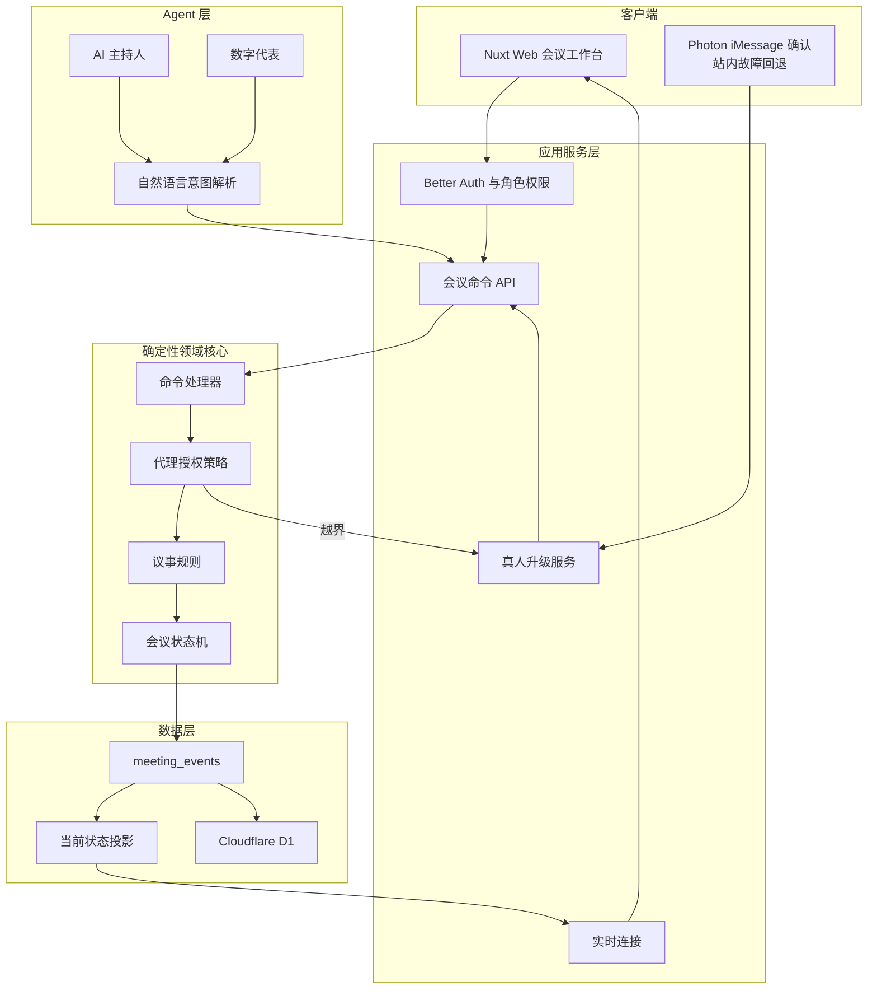

# Gavity 技术架构

状态：目标架构  
原则：在现有 Bun、Nuxt 4、Drizzle、Cloudflare 架构上增量演进。

## 架构结论

Gavity 采用模块化单体，而不是在 MVP 阶段拆分微服务。服务端保存权威会议状态；客户端、AI 主持人和数字代表都只能提交命令，不能直接写入状态。



## 命令处理链

所有改变会议的动作必须经过同一条路径：

```text
输入
→ 身份认证
→ 结构校验
→ 角色权限校验
→ 数字代表授权校验
→ 议事规则校验
→ 产生领域事件
→ 事务写入事件与状态
→ 实时广播
```

AI 只能把自然语言解析为候选命令。例如：

```json
{
  "type": "PROPOSE_AMENDMENT",
  "meetingId": "meeting_demo",
  "agendaItemId": "agenda_budget",
  "motionId": "motion_budget",
  "payload": {
    "budgetLimit": 11000
  }
}
```

候选命令必须经过与真人操作完全相同的校验。

## 目录目标

```text
app/
  components/          # 展示和轻量交互
  utils/               # 客户端协调与 API 调用
server/
  api/                 # HTTP / 实时入口
  services/            # 应用服务、通知、Agent 编排
  utils/db/            # Drizzle 与数据库绑定
shared/
  domain/              # 纯函数领域核心
    commands.ts
    events.ts
    meeting-machine.ts
    parliamentary-rules.ts
    mandate-policy.ts
    schemas.ts
  contracts/           # API 请求和响应 Schema
tests/
  domain/
  integration/
  e2e/
```

遵守项目既有约定：共享或复杂业务逻辑使用 `utils` 和纯模块，不创建承载大量业务状态的大型 composable。

## 数据模型

MVP 至少需要：

- `organizations`
- `organization_members`
- `meetings`
- `agenda_items`
- `meeting_participants`
- `delegate_mandates`
- `motions`
- `active_votes`
- `ballots`
- `human_approvals`
- `meeting_events`
- `meeting_projections`
- `decisions`
- Better Auth 相关表

### 事件日志

`meeting_events` 是审计事实来源，至少包含：

- 事件 ID 与顺序号；
- 组织和会议 ID；
- 事件类型和版本；
- 行为主体 ID；
- 主体类型：human、delegate、chair-agent、system；
- 授权 ID；
- 关联议程、动议或表决 ID；
- 结构化载荷；
- 服务端时间；
- 幂等键。

当前状态投影用于快速读取，但不能取代事件历史。

## 实时模型

- D1 保存持久化数据和审计事件；
- 单场会议需要有唯一的实时协调者；
- Cloudflare Durable Object 或等价单写者机制负责命令串行化、计时和 WebSocket 广播；
- 断线客户端通过最后事件序号补齐事件；
- 重复命令通过幂等键拒绝；
- 表决截止时间以服务端时间为准。

## Agent 模型

### AI 主持人

- 读取公开会议状态和组织规则；
- 提交主持命令；
- 不读取成员私人授权全文，除非完成当前校验确有必要；
- 不参与表决；
- 不直接写数据库。

### 数字代表

- 读取授权后的必要上下文；
- 以主人身份之外的明确代理身份行动；
- 提交的每个命令携带授权引用；
- 越界时只能请求升级，不能自行扩大权限。

### LLM 边界

- 自然语言理解、总结和解释可以是概率性的；
- 状态转换、票数、权限和法定人数必须是确定性的；
- 模型输出必须使用 Schema 校验；
- 模型输入视为不可信内容，会议发言不能覆盖系统规则；
- 生产日志不得保存不必要的隐私内容。

## Photon iMessage 集成

Photon iMessage 是 MVP 的真人升级主链路，必须通过独立适配器接入，不能把供应商调用散落在领域逻辑中。

```text
授权策略判定越界
→ 创建 human_approval
→ 事务提交
→ 通知队列调用 Photon iMessage
→ 真人回复进入签名回调入口
→ 验证来源、幂等键、会议范围和有效期
→ 写入 HUMAN_APPROVAL_RESOLVED
→ 生成一次性授权
→ 代理重新提交原候选命令
```

要求：

- 发送与回调均支持幂等；
- 回调签名和来源必须验证；
- 手机号或通信标识加密或最小化保存；
- 消息正文只包含完成决定所需的最少会议信息；
- 超时、失败和重复回复必须有确定性状态；
- 本地开发使用同一适配器接口的模拟实现；
- 外部服务故障时允许站内确认，但必须记录回退原因。

## 安全边界

- 服务端从认证会话推导主体，不能信任客户端提交的用户 ID；
- 私人授权默认只向其主人和授权校验服务开放；
- 秘密投票不得把单票内容广播给其他客户端；
- 真人确认必须限定范围、期限并防重放；
- 代理撤权后所有未完成动作立即失效；
- 密钥只存放于本地 `.dev.vars` 或部署平台 Secret；
- Photon 凭据、回调密钥和测试号码不得提交到仓库；
- 生产环境与演示环境使用不同数据。

## 现有代码迁移原则

- 保留当前 UI 和用户可见行为；
- 将 `app/utils/meetings.ts` 中的状态转换逐步移入 `shared/domain`；
- 将 `app/utils/rules.ts` 改造成客户端和服务端共用的纯规则模块；
- 将 `app/utils/bots.ts` 限定为演示驱动器，移除随机决定；
- 数据库和 API 就绪前，使用适配器让现有 UI 调用新领域核心；
- 每次迁移只覆盖一组行为，并先补测试。

## 部署目标

- Nuxt Nitro 运行于 Cloudflare Workers；
- D1 负责持久化；
- Durable Object 负责单场会议实时协调；
- 每次数据库变更通过 Drizzle migration；
- 提供本地、测试、生产三套配置；
- 部署前执行 lint、测试、构建和数据库迁移检查。
